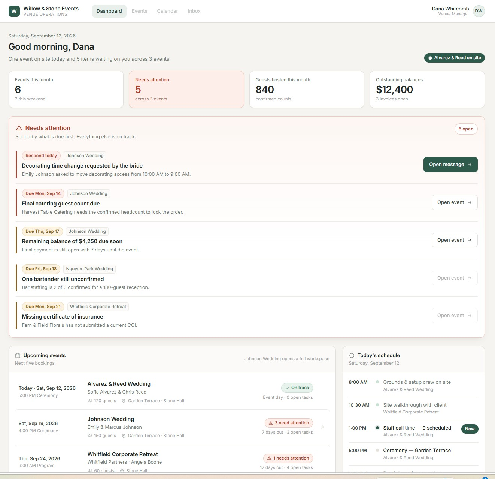
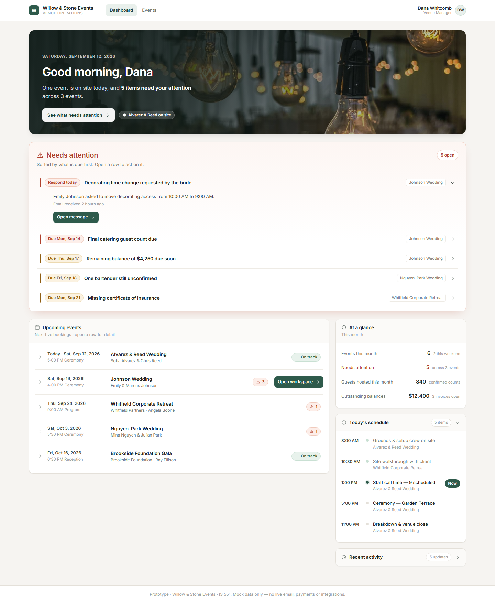
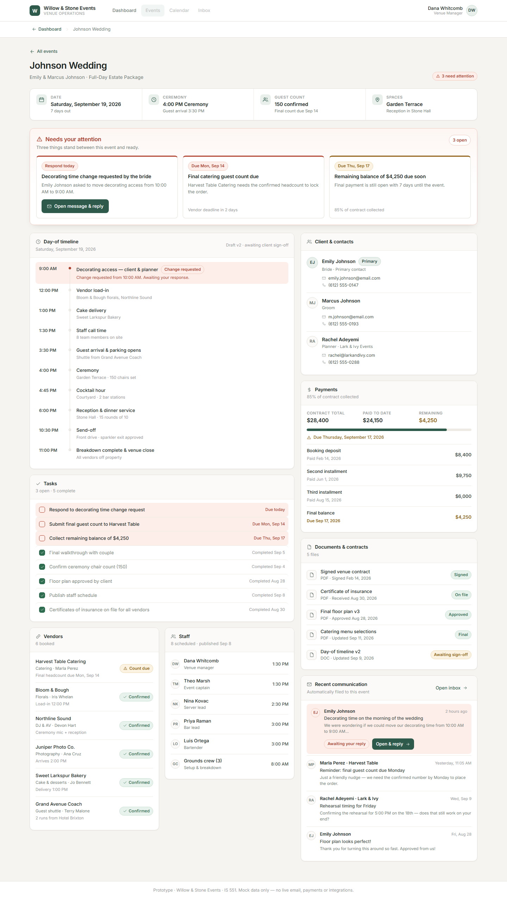
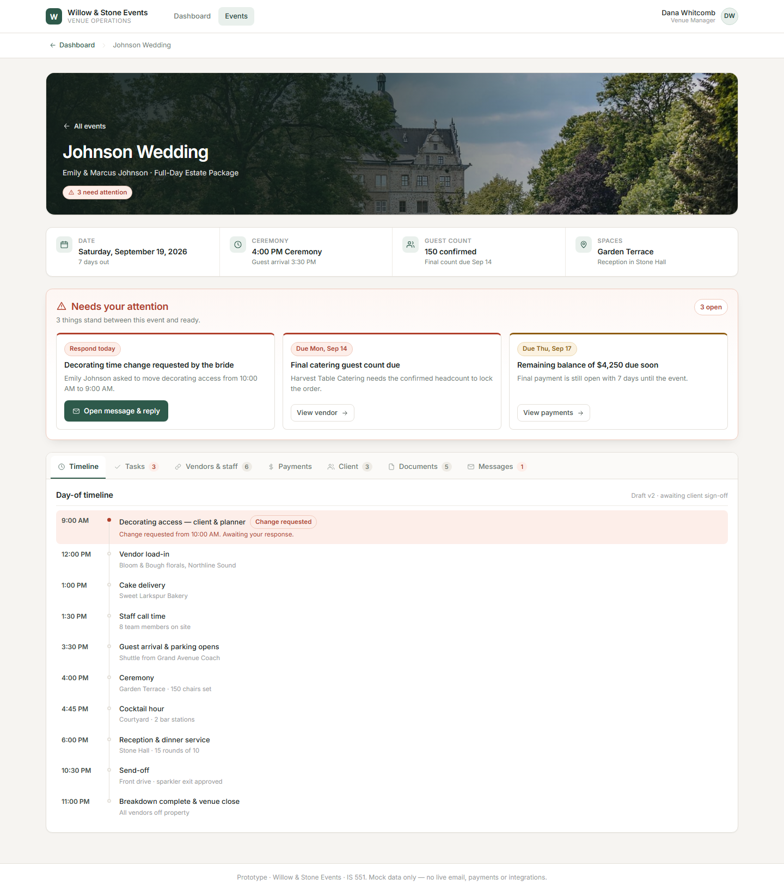

# Willow & Stone Events — Venue Management Prototype

IS 551 · Interactive prototype + written analysis

---

## About this project

This is a working three-screen prototype of an event venue management platform. The fictional
venue is called Willow & Stone Events, and the prototype follows one real scenario: a wedding
coming up in seven days that has three loose ends the manager hasn't dealt with yet.

**What it is:** a clickable React prototype with realistic fake data. Three screens, no backend,
no database, no login, no real email.

**Who it's for:** managers and coordinators at small-to-medium wedding and event venues.

**The problem it goes after:** the information about a single event lives in five or six
different places, so figuring out what's actually done and what's still hanging is slow and
easy to get wrong.

**Important scope note:** this is deliberately *not* a complete event-management product. A real
version of this would need a CRM, contracts, invoicing, vendor portals, staff scheduling, floor
plans, reporting, and an actual email integration. I built three screens because the assignment
is about testing whether the core value proposition lands, not about shipping a SaaS product.
Anything that didn't help test that idea got left out on purpose.

---

## Running Locally

Built with **React 18** and **Vite 5**, plain CSS, no UI framework. You need Node.js 18+.

```bash
cd willow-stone-events
npm install
npm run dev
```

Vite prints a local URL (usually http://localhost:5173) and opens it in your browser. `Ctrl + C`
stops it.

To check the production build:

```bash
npm run build     # builds into dist/
npm run preview   # serves the built version locally
```

**Note on resetting:** sending the reply on Screen 3 changes the prototype's state for the rest
of that session. Just refresh the page to put everything back to the starting state.

All the fake content — event names, dates, vendors, payments, the bride's email, the AI draft —
lives in one file, `src/data.js`, so it's easy to change without digging through components.

---

## 1. Need

Event venue managers coordinate the details of each event across email, calendars, spreadsheets,
documents, payment records, vendor communication, and staff schedules. Because that information
is spread across separate systems that don't talk to each other, it's hard to quickly tell what
has already been handled, what is still outstanding, and whether something time-sensitive is
about to be missed. The risk isn't that any single piece of information is unavailable — it's
that no one place shows the current state of an event, so staying on top of it depends on
memory and manual checking.

## 2. Persona

Coordinators and managers at small-to-medium wedding and event venues — the kind of place that
books somewhere between 30 and 80 events a year and runs with a very small office team, often
one or two people handling everything. They're usually juggling five to ten upcoming events at
different stages at the same time: one happening this weekend, one that's a week out and needs
final numbers, a few that are months away.

Their current toolkit is email for client and vendor communication, a shared calendar for
bookings, spreadsheets for guest counts and payments, and a folder of PDFs for contracts and
floor plans. They're not looking for new software to learn. They're comfortable with the tools
they have — the problem is how many of them there are.

## 3. Primary Capability

The user can open a single upcoming event, see its complete current status in one place, and
act on the items that need a response without leaving the system or opening another tool.

## 4. Fundamental Value

**Control.**

The manager can tell, at a glance and with confidence, where every event stands — and knows that
anything needing their attention has surfaced on its own instead of waiting to be discovered.
The value isn't that the work gets done faster. It's that nothing important slips by unnoticed.

---

# The Three Screens

The flow is **Dashboard → Johnson Wedding → Message + AI reply**, and the state carries back the
other way when you resolve something.

## Screen 1 — Venue Dashboard

**Primary job:** answer "what needs my attention?" before answering anything else.

**What's actually on it:** the page opens on a photographic welcome band — a wedding reception
under Edison bulbs — carrying the date, "Good morning, Dana," and the one sentence that matters:
*"One event is on site today, and 5 items need your attention across 3 events."* One button,
**"See what needs attention,"** scrolls to the queue.

Below that, the red-bordered **Needs attention** panel. Each of the five items is a single line
— due date, title, and which event it belongs to — that expands on click to reveal the detail
and its action button. The most urgent one is open by default, so the screen still answers "what
do I do next?" without being read. Then **Upcoming events**: five one-line rows that expand for
guest count, spaces, status and open tasks; the Johnson Wedding row carries a green
**"Open workspace →"** button directly on the line.

The right rail holds the quieter material: **At a glance** (events this month, needs attention,
guests hosted, outstanding balances), **Today's schedule**, and **Recent activity**, which starts
collapsed behind a header showing "5 updates."

**Why it earned a slot:** this is the screen that has to carry the fundamental value on its own.
If a venue manager can't look at this for a few seconds and come away knowing what's on fire,
nothing on the other two screens matters. It's also the only screen that shows more than one
event, which is what makes the "juggling five things at once" problem visible.

**Design question it examines:** *Can a venue manager understand within a few seconds what's
happening at their venue and what they need to do next?*

## Screen 2 — Johnson Wedding Event Workspace

**Primary job:** show the complete status of one event without making the user open anything
else.

**What's actually on it:** three things stay pinned no matter what you came to do. A
photographic header banner of the estate grounds with a ceremony set up on the lawn, carrying the
event name, the clients, and a "3 need attention" badge. Then a row of four key facts (date — Saturday, September 19, 2026 · ceremony —
4:00 PM · guest count — 150 confirmed · spaces — Garden Terrace / Stone Hall). Then a **Needs
your attention** band with three cards: the decorating time change, the final catering count due
Sept 14, and the $4,250 balance due Sept 17. The first card has the button that goes to Screen 3;
the other two jump to the relevant tab.

Everything else sits behind seven tabs, each showing a live count so you can see what's there
without opening it:

| Tab | What's in it |
|---|---|
| **Timeline** | Ten stops from 9:00 AM decorating access to 11:00 PM venue close; the unresolved decorating row is highlighted red |
| **Tasks** `3` | 3 open, 5 complete, with the three open ones flagged |
| **Vendors & staff** `6` | 6 vendors (one flagged "Count due") and 6 staff entries with call times |
| **Payments** | $28,400 total, $24,150 paid, $4,250 remaining, a progress bar, and the full installment history |
| **Client** `3` | Emily Johnson (bride, primary), Marcus Johnson, and Rachel Adeyemi the planner, with emails and phone numbers |
| **Documents** `5` | Contract, COI, floor plan, menu selections, and the timeline awaiting sign-off |
| **Messages** `1` | 4 messages filed automatically to this event, with the unanswered one highlighted |

**Why it earned a slot:** this is the screen that proves the primary capability. The whole claim
of the product is "one place instead of six," and this is the only way to actually demonstrate
that — by putting the contract, the money, the vendors, the staff, the timeline, and the emails
in a single view that a manager would currently have to assemble from four browser tabs and a
filing cabinet.

**Design question it examines:** *Does putting all of this together in one view actually make
the manager feel more informed and in control than what they do now, or is it just a lot of
information on one page?*

## Screen 3 — Message + AI Assistant

**Primary job:** let the manager resolve one of the attention items end to end without leaving
the product.

**What's actually on it:** on the left, the bride's actual email asking to move decorating from
10:00 AM to 9:00 AM, and below it a **Suggested reply** panel. The panel is labeled "Draft · not
sent," shows a row of chips listing what the draft was based on (the Sept 19 timeline, the venue
access terms in the contract, the booking calendar for Sept 18–19, the grounds crew schedule,
and the open guest-count task), and puts the draft in a fully editable text box. Buttons are
Restore original draft, Cancel, and **Send reply**.

On the right is the context panel — event, date, ceremony, guests, current decorating window,
earliest allowed venue access, whether anything is booked the night before, when the grounds
crew arrives, and the next vendor load-in — ending with a green "No conflict found — a 9:00 AM
start is available" line. Under that, the other two open items for this event, and the client's
phone numbers.

When you hit Send reply, the button shows "Sending…" for a beat, then a green banner confirms
the reply went out and the item is resolved. The sent email appears in the thread underneath the
bride's message. Going back to Screen 2, the timeline row now reads "Confirmed 9:00 AM," the
task is checked off, and the badge drops to "2 need attention." The dashboard counter drops from
5 to 4.

**Why it earned a slot:** without this screen, the product is just a nicer dashboard — it tells
you about problems but you still have to go to Outlook to do anything. This screen is what turns
"I can see what needs attention" into "I can handle what needs attention," which is the
difference between an information product and a control product.

**Design question it examines:** *Would having communication and AI drafting inside the event
system meaningfully cut down the work of managing an event — and would a venue manager trust an
AI-written reply enough to send it to a client?*

---

# Design Question Plan / Feedback Questions

I have **not** collected any feedback yet. These are the four questions I would ask actual venue managers,
plus what I'm predicting they'll say and why I think that. Writing the predictions down first is
the point — if the real answers don't match, that tells me something.

### Question 1 — Category: Capability

**Question:** "I'm going to show you this screen for five seconds, then hide it. After that, tell
me what you think this product does."

**My prediction:** They'll say something close to "it shows your upcoming events and what you
need to deal with." I think they'll specifically mention the red section or use the word
"attention," because that's the only colored block on an otherwise neutral page.

**What in the prototype made me predict that:** On the dashboard, the **Needs attention** panel
is the only element with a red border and tinted background, and it sits above the events list.
Of the four stat tiles, only *Needs attention* is colored. I deliberately kept everything else
neutral grey and white so that in a five-second glance there's really only one thing to look at.
If this prediction is wrong, my color hierarchy isn't doing what I think it is.

### Question 2 — Category: Need

**Question:** "Walk me through the last time you had to check on an event that was a week or two
out. What did you actually open, and in what order?"

**My prediction:** They'll list at least three separate places — email first, then a calendar or
a spreadsheet, then a contract or invoice folder — and I think they'll mention having to check
something twice or ask a coworker because they weren't sure it had been handled.

**What in the prototype made me predict that:** This question is really testing whether the whole
premise is true. The three attention items I chose (an unanswered client email, a vendor deadline
for a guest count, and an unpaid balance) each come from a *different* system in real life —
inbox, vendor communication, accounting. If they describe a workflow where everything already
lives in one tool, my need statement is weaker than I think it is.

### Question 3 — Category: Persona

**Question:** "How many events do you personally have in progress right now, and who else at the
venue would know their status if you were out sick tomorrow?"

**My prediction:** I'm guessing five to ten active events and a very uncomfortable pause on the
second half — either "nobody, really" or "my manager could figure it out from my email."

**What in the prototype made me predict that:** I designed the dashboard around five concurrent
events at different stages (one happening today, one seven days out, three further away) and
built it for a single named person, Dana Whitcomb. If it turns out they only handle one or two
events at a time, or that a team shares every event, then a multi-event dashboard isn't solving
their actual problem and my persona is off.

### Question 4 — Category: Value

**Question:** "What's the thing you most worry about forgetting in the week before an event?"

**My prediction:** Final guest counts for catering, and money that hasn't come in yet. I also
think at least one person will say something about a client request they meant to answer and
didn't get back to.

**What in the prototype made me predict that:** Those are literally the three attention items I
picked for the Johnson Wedding — unanswered bride email, catering count due, balance due. I
chose them because they felt like the obvious candidates, but I'm essentially guessing. If they
name something completely different (weather backup plans, a staff no-show, a rental delivery),
then the prototype is demonstrating control over the wrong things and I should swap the example
data.

---

# Design Justification and First Read

Going through the screens honestly, including the parts I'm not happy with.

> **Note:** this is my first-read evaluation of the **initial AI-generated version** — it's the
> analysis that drove the revision, so I've left it as written rather than rewriting it after the
> fact. Where a problem has since been fixed, it's marked **→ Fixed in the revision**, and the
> "Initial AI Output and Revision" section below covers what changed.

### 1. Does the landing screen communicate the primary capability and fundamental value at first glance?

Mostly yes. The subheading under the greeting reads "One event on site today and 5 items waiting
on you across 3 events," which states the capability in words before any layout does the work.
Then the **Needs attention** panel is the only red element on the page, and it's above the events
list, so the eye lands on it first.

Where it falls short: the page never says what the product *is*. The top bar says "Willow & Stone
Events / Venue Operations," which is the venue's name, not a description. Someone who's never
seen it might understand "these are things I need to do" without understanding "this pulls
together email, payments, and vendors." The value (control) comes across; the mechanism doesn't.

### 2. Does every element on the landing screen earn its place?

Three things I'd defend, one I'd cut, and one that's actively a problem:

- **Needs attention panel** — earns it. It's the primary job.
- **Upcoming events list** — earns it. It's how the multi-event reality becomes visible, and it's
  the only route into Screen 2.
- **Today's schedule** — earns it, barely. It grounds the product in a real operating day and
  supports the "what's happening right now" half of the question.
- **Recent activity** — this is the weakest element. It's five lines of things that already
  happened, which is the opposite of "what needs my attention." Its only real job is signaling
  that the system is automatically capturing events from other tools. I'd consider cutting it or
  shrinking it. **→ Fixed in the revision** — it now starts collapsed.
- **The disabled top nav (Events / Calendar / Inbox)** — this one is a genuine problem. I greyed
  those out on purpose so the prototype wouldn't promise screens that don't exist, but in
  practice the first thing I instinctively did when trying to get to the event page was click
  "Events," and nothing happened. A signifier that looks like navigation but isn't costs the user
  time. This is my strongest candidate for the revision. **→ Fixed in the revision.**

The four stat tiles are also worth flagging. Three of them (events this month, guests hosted,
outstanding balances) are context, not action. They don't compete visually because they're
neutral while the attention tile is red, but they're the closest thing on the page to decoration.
**→ Fixed in the revision** — they moved into the right rail as a compact list.

### 3. What's visually grouped together on each screen?

**Dashboard:** four bands top to bottom — identity/greeting, the stat row, the attention panel,
then a two-column split with events on the left and today/activity on the right. The grouping
logic is "everything that requires a decision is above everything that's just context."

**Event workspace:** identity band (name + the four key facts), then the attention band, then a
two-column split where the left column is *running the day* (timeline, tasks, vendors, staff) and
the right column is *the client and the business* (contacts, payments, documents, communication).
That left/right division is itself a grouping decision — operational vs. commercial.

**Communication screen:** left column is the conversation (the bride's message and the reply I'm
writing), right column is everything I need in order to answer (event context, other open items,
client phone numbers). Grouped by "the thing I'm doing" vs. "what I need to know to do it."

### 4. How are Gestalt principles used to communicate those groups?

**Proximity** — the four facts a manager gets asked for constantly (date, ceremony time, guest
count, spaces) sit in one tight band directly under the event name rather than being scattered.
Each vendor's name, role, contact, and status note are on one line together. In the payment card,
the three figures sit in a row directly above the progress bar that describes them.

**Common region** — every group is inside a bordered white card on a warm grey background, and
each card holds exactly one subject. The border does the grouping, which means the headings don't
have to be loud.

**Similarity** — anything with the same function looks identical everywhere in the product. Every
status label is the same pill component, every person is the same circular avatar with initials,
every list of things uses the same row layout. The payoff is that when five vendors look the same
and one has an amber "Count due" pill, the exception is obvious without reading.

**Continuity** — the day-of timeline uses a vertical line connecting each stop, so it reads as a
sequence instead of ten separate facts.

There's also a deliberate rule about color that supports all of this: red-clay means act now,
amber means due soon, green means settled, and everything else stays neutral. No color is used
decoratively anywhere, which is what allows the attention signals to win without being loud.
(More detail on this in `DESIGN-PRINCIPLES.md`.)

### 5. Do Screens 2 and 3 stay focused on the primary capability?

Screen 2 mostly does. Everything on it is a real part of an event's status, and the three
attention cards are placed above the detail so the screen leads with action rather than data.
The honest risk is density — it's a long page, and a first-time user could read it as "a lot of
information" rather than "everything in one place." I think the card boundaries and the two-column
split hold it together, but this is the thing I'd most want to watch someone actually use.

Screen 3 stays tight. There's nothing on it that isn't either the message, the reply, or context
needed to write the reply. I resisted adding an inbox list or a full email client, which would
have been a fourth screen wearing a disguise.

### 6. Can the user get back to the landing screen from everywhere?

Yes, multiple ways from both subscreens:

- The **Willow & Stone Events** logo in the top bar is a button that returns to the dashboard from
  any screen.
- A **breadcrumb bar** appears on Screens 2 and 3 with a "← Dashboard" link, and on Screen 3 the
  breadcrumb also includes a "Johnson Wedding" link back to Screen 2.
- Screen 2 has an "← All events" link above the event title.
- Screen 3 has a "← Johnson Wedding workspace" link above the subject line, plus **Back to event**
  and **Dashboard** buttons in the green confirmation banner after sending.

So the way back is never more than one click, and there's no dead end. The weaker direction is
*forward* — getting from the dashboard into Screen 2 depends on knowing the Johnson Wedding row
is clickable, and at rest the only cue is a very light grey chevron that's easy to miss.
**→ Fixed in the revision** — it is now a labelled "Open workspace" button.

---

## Initial AI Output and Revision

The initial AI-generated version is preserved as the first commit on `main`
(`Initial AI-generated prototype`). This section covers what I changed afterward and why.

### What the AI got wrong, skipped, or oversimplified

**1. It treated "show everything" as the same thing as "one place."** The core promise of the
product is that an event lives in one view instead of six systems. The AI delivered that
literally — the event workspace stacked eleven cards in two columns, all expanded at once.
Everything was visible, which meant nothing was dominant. A first-time viewer read the screen as
"that's a lot of information" rather than "everything I need is here." That undercuts the
fundamental value: control doesn't feel like control if you have to scan a wall of cards to find
anything.

**2. Its signifiers only appeared on hover.** The Johnson Wedding row was the only clickable row
in the upcoming events list, but at rest the only cue was a chevron colored `#e4e0d9` — nearly
invisible against white. The hover state was well built (background tint, green ring, the
chevron slides right), but hover happens *after* you've already decided where to click. I
actually got stuck on this myself when I first opened the prototype and couldn't work out how to
reach the second screen.

**3. It created false affordances in the top nav.** The AI rendered Dashboard, Events, Calendar
and Inbox, with the last three greyed out — the reasoning being that it shouldn't promise screens
that don't exist. But the first thing I instinctively did when trying to reach an event was click
"Events," and nothing happened. A disabled control that looks like the obvious path costs the
user more time than not having it at all.

**4. It opened like a briefing, not like a product.** This one only became obvious after fixing
the first three. Even with less on screen, the dashboard still greeted a first-time viewer with a
wall of fully-written work items. Nothing was wrong with any individual element — the problem was
that the page led with obligations instead of orienting you first. Software people actually enjoy
using tends to welcome you, then reveal detail as you ask for it.

**5. It kept a card that works against the screen's job.** "Recent activity" is a log of things
that already happened, sitting expanded on a screen whose entire purpose is surfacing what still
needs doing. The AI even flagged this as the weakest element in its own first-read evaluation,
then left it fully expanded anyway.

### What I changed

The revision happened in two passes. The first cut the *amount* on screen; the second changed how
the page *greets* you, after looking at it again and realising it still opened like a briefing
rather than a product.

#### Pass 1 — hide the bulk

**Event workspace — tabbed detail.** Only the things that are true of the event regardless of why
you opened it stay pinned: the header, the four key facts (date, ceremony, guest count, spaces),
and the three attention cards. Everything else moved behind seven tabs — Timeline, Tasks,
Vendors & staff, Payments, Client, Documents, Messages. Nothing was deleted; every card from v1
still exists.

**Dashboard — attention promoted, context demoted.** The four large stat tiles that used to sit
*above* the attention panel are now a compact "At a glance" list in the right rail, so Needs
attention is the first substantial thing on the page. Its heading grew, and it picked up a soft
shadow so it sits visually forward of everything else. "Recent activity" now starts collapsed.

**Signifiers throughout.**
- The faint chevron is gone; the Johnson Wedding row now carries a filled green
  **"Open workspace →"** button that's visible without hovering.
- Every tab shows a count badge, and the counts are live — Tasks reads `3` and drops to `2` after
  you resolve the decorating request, Messages shows `1` in red while a reply is outstanding and
  reverts to `4` once it's sent.
- The active tab is signified three ways at once: weight, color, and an underline.
- The collapsed card's chevron rotates 90° when it opens.
- The two attention cards that don't open a message got **"View vendor →"** and
  **"View payments →"** buttons that jump straight to the matching tab.

**Navigation.** Calendar and Inbox are gone, and **Events** now actually works — it opens the
Johnson Wedding workspace.

#### Pass 2 — welcome first, then disclose

Pass 1 made the workspace much better but left the dashboard still opening with five fully
written attention items and five four-line event rows. It was organised, but it still arrived all
at once. Most software people actually enjoy using doesn't do that.

**A welcome band instead of a data header.** The dashboard now opens on a full-width photograph
with a single sentence and one button. It states the number that matters and gives you one thing
to do. Nothing else competes with it.

**Both long lists became disclosure rows.** Every attention item and every event is now one line
that opens on click. The closed line still carries enough to triage — status pill, title, which
event — so opening a row is for *acting* on it, not for finding out what it is. The most urgent
attention item is open by default so the screen's job still gets done without any clicking.

**Real photography.** Two photographs from Pixabay replaced the SVG illustrations I drew in pass
1: a reception under Edison bulbs for the dashboard, and estate grounds with a ceremony set up on
the lawn for the event header. They're downsized, compressed and committed into `src/assets/`
rather than hot-linked, so the prototype can't break if the source host changes. Both sit under
an angled dark scrim so the overlaid text keeps its contrast; on narrow screens the scrim becomes
a straight vertical gradient because the angled one gets cropped.

**Collapsed rails.** "Today's schedule" and "Recent activity" are both collapsible cards now, each
with a count badge.

### Why I changed it

The revision is aimed at the design question behind Screen 2: *does putting all of this together
make the manager feel more informed and in control, or is it just a lot of information on one
page?* Version 1 was losing that argument. I also wanted the five-second test from my feedback
plan to stand a real chance — if a venue manager only looks at the dashboard for five seconds,
the attention panel has to be the thing they see, not the fourth thing down the page.

### Which principles motivated it

**Progressive disclosure / Gall's Law.** Show the simple thing that works first and let the user
ask for the rest. Tabs and the collapsed card mean less is on screen, but nothing was taken away
— every count badge announces what's hidden, so hiding content never hides the *existence* of
content.

**Signifiers (Norman).** An affordance nobody can perceive isn't an affordance. Every cue that
previously only existed on hover now exists at rest: a labeled button instead of a pale chevron,
count badges instead of silence, a rotating chevron instead of a static one.

**No interference / no false affordances.** Removing Calendar and Inbox eliminated two controls
that looked like the way forward and weren't. Demoting the stat tiles removed three neutral
blocks that were competing for position with the one block that implies work.

**Proximity and common region.** The tab strip and its panel form a single bordered region, so
"Payments" and its contents read as one object. Pinning the four key facts directly under the
title keeps the identity of the event grouped and constant while the detail below changes.

### Before and after

**Screen 1 — Venue dashboard**

| Before | After |
|---|---|
|  |  |

Four large stat tiles pushed Needs attention down the page; the nav showed three dead links; the
Johnson Wedding row had no visible control. After: the greeting is compact with venue artwork,
Needs attention is the first major block, the stats have shrunk into the right rail, Recent
activity is collapsed to a single row, and the Johnson Wedding row has a green "Open workspace"
button.

**Screen 2 — Event workspace**

| Before | After |
|---|---|
|  |  |

Eleven cards stacked in two columns versus a banner, four pinned facts, three attention cards,
and a tab strip.

**Measured result:** at a 1440px viewport the event workspace went from **2553px to 1636px** of
page height — 36% less page for exactly the same information.

The dashboard is a more honest story: it went from **1849px to 1753px**, which is barely a change,
because the welcome photograph takes real vertical space. The number that actually moved is how
much is *expanded* at once — it used to open with five fully written attention items (title,
description and button each) and five four-line event rows. It now opens with one expanded item,
four single lines, five single-line events, and two collapsed cards. Same information, roughly the
same height, but the page no longer hands you all of it before you've asked.

### Git workflow for this assignment

- [x] Commit the initial AI-generated version to `main`
- [x] Create a branch for revisions (`revision`)
- [x] Make the revision and commit it
- [ ] Open a pull request and merge it into `main`
- [x] Deploy to a public URL — <https://mitchfranks.github.io/willow-stone-events/>
---

## Project Structure

```
willow-stone-events/
├── index.html                 page shell, font, favicon
├── package.json               scripts and dependencies
├── vite.config.js             dev server + build settings
├── README.md                  this file
├── DESIGN-PRINCIPLES.md       longer notes on grouping, signifiers, and Gall's Law
├── docs/                      before & after screenshots for the revision write-up
└── src/
    ├── main.jsx               React entry point
    ├── App.jsx                all app state and navigation between the three screens
    ├── data.js                every piece of mock content in the prototype
    ├── styles.css             the whole design system in one file
    ├── assets/
    │   ├── hero-reception.jpg dashboard welcome band
    │   └── event-estate.jpg   event workspace header
    └── components/
        ├── AppShell.jsx       top bar, breadcrumbs, footer — wraps all three screens
        ├── Dashboard.jsx      Screen 1
        ├── EventWorkspace.jsx Screen 2
        ├── Communication.jsx  Screen 3
        └── ui.jsx             shared pieces: Card, Pill, Avatar, Icon, Field,
                               Tabs, Collapsible, DisclosureRow
```

There's no router and no server. `App.jsx` holds two pieces of state — which screen is showing,
and which attention items have been resolved — and every count on every screen is calculated from
that second one. That's why resolving the decorating request on Screen 3 correctly updates the
badge on Screen 2 and the counter on Screen 1 without any of them being hardcoded.

---

## Credits

Photography from [Pixabay](https://pixabay.com), used under the
[Pixabay Content License](https://pixabay.com/service/license-summary/) (free to use, attribution
not required — included here anyway). Images were downsized and compressed, and are committed
into `src/assets/` rather than hot-linked so the prototype doesn't depend on an external host.

Everything else — the venue, the events, the people, the emails, the payments — is invented for
this assignment. Any resemblance to a real venue or client is coincidental.
